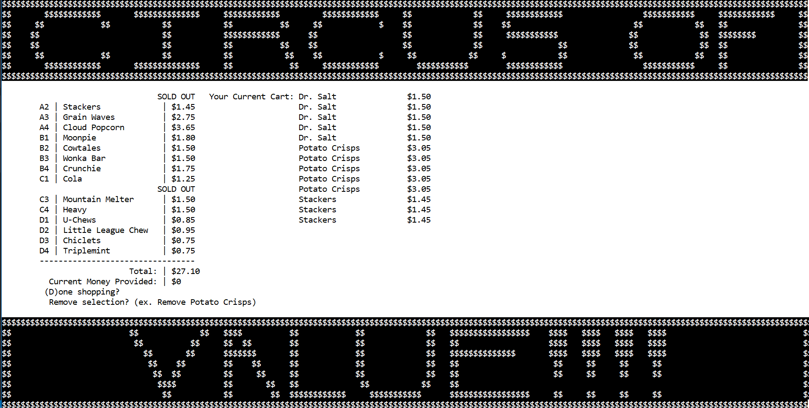
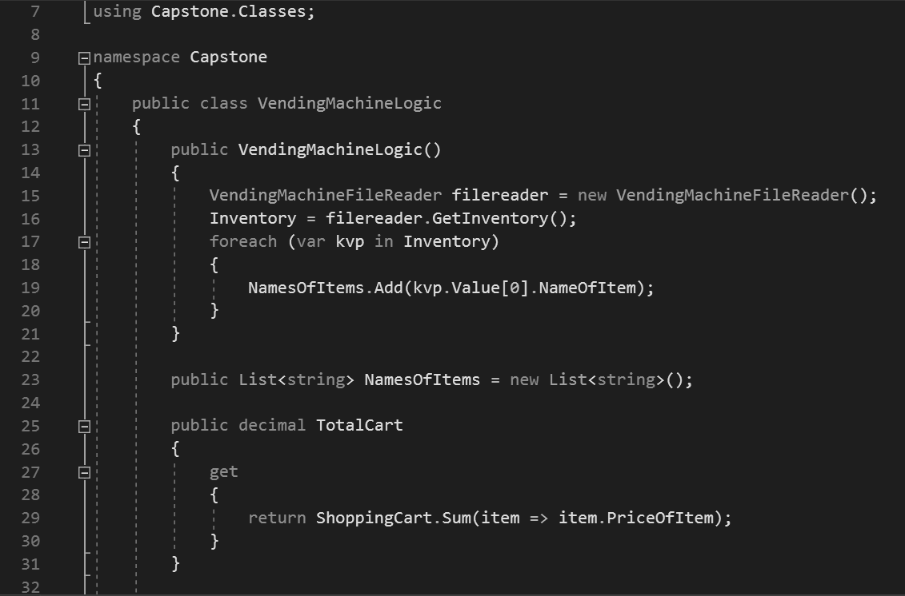

Vending Machine software written in C# with .NET Framework

Requirements were to be able to gather inventory, accept payments, build a shopping cart, give change and dispense items. 

Nothing was mentioned about making ridiculous scrolling animations in a console application with deranged clown imagery and sounds (courtesy of Bioshock) but they didn't mention _not to_ so what else could I have done?

## Some of the challenges of this project included: 

* Figuring out the algorithm to make text scroll in a console application. I ended up concatenating substrings of the strings based on the length of the ASCII art and repeating the process until the user clicks out of the screen. 
* Figuring out how to get sound files to ship along with the code and play over the events on screen.
* Adding in hidden submenues with password protection and within those providing the ability to automatically open files on the local system by responding to user input.
* Encapsulating the data into relevant areas of the application so that machine logic was kept separated from the CLI and using polymorphism to have each vending machine item capable of being loaded into the same machine and vended in the same way, but maintaining their individuality at the same time
* Utilizing regular expressions to provide the ability to remove items from the shopping cart on the fly based on whether the user selected the item via it's slot Id or it's name

